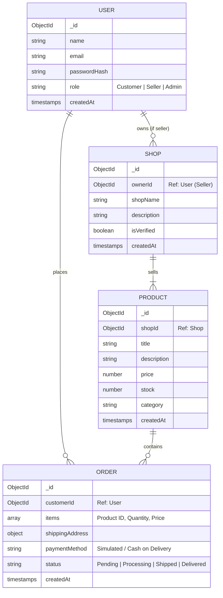

```mermaid
erDiagram
    USER {
        ObjectId _id
        string name
        string email
        string passwordHash
        string role "Customer | Seller | Admin"
        timestamps createdAt
    }

    SHOP {
        ObjectId _id
        ObjectId ownerId "Ref: User (Seller)"
        string shopName
        string description
        boolean isVerified
        timestamps createdAt
    }

    PRODUCT {
        ObjectId _id
        ObjectId shopId "Ref: Shop"
        string title
        string description
        number price
        number stock
        string category
        timestamps createdAt
    }

    ORDER {
        ObjectId _id
        ObjectId customerId "Ref: User"
        array items "Product ID, Quantity, Price"
        object shippingAddress
        string paymentMethod "Simulated / Cash on Delivery"
        string status "Pending | Processing | Shipped | Delivered"
        timestamps createdAt
    }

    USER ||--o{ SHOP : "owns (if seller)"
    USER ||--o{ ORDER : "places"
    SHOP ||--|{ PRODUCT : "sells"
    PRODUCT ||--o{ ORDER : "contains"

```
