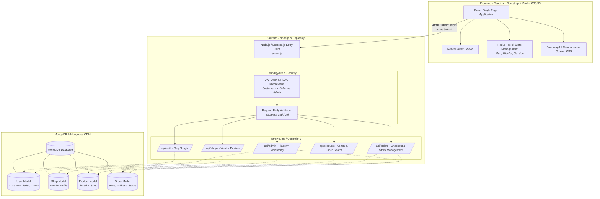

```mermaid
graph TD
    subgraph Client Layer [Frontend - React.js + Bootstrap + Vanilla CSS/JS]
        UI[React Single Page Application]
        Router[React Router / Views]
        Redux[Redux Toolkit State Management <br/><i>Cart, Wishlist, Session</i>]
        BootstrapUI[Bootstrap UI Components / Custom CSS]

        UI --> Router
        UI --> Redux
        UI --> BootstrapUI
    end

    subgraph Server Layer [Backend - Node.js & Express.js]
        Server[Node.js / Express.js Entry Point <br/>server.js]

        subgraph Middleware & Security
            AuthMW[JWT Auth & RBAC Middleware <br/><i>Customer vs. Seller vs. Admin</i>]
            Validator[Request Body Validation <br/><i>Express / Zod / Joi</i>]
        end

        subgraph API Routes / Controllers
            AuthRoutes[/api/auth - Reg / Login/]
            ProductRoutes[/api/products - CRUD & Public Search/]
            ShopRoutes[/api/shops - Vendor Profiles/]
            OrderRoutes[/api/orders - Checkout & Stock Management/]
            AdminRoutes[/api/admin - Platform Monitoring/]
        end

        Server --> AuthMW --> Validator
        Validator --> AuthRoutes
        Validator --> ProductRoutes
        Validator --> ShopRoutes
        Validator --> OrderRoutes
        Validator --> AdminRoutes
    end

    subgraph Database Layer [MongoDB & Mongoose ODM]
        MongoDB[(MongoDB Database)]

        UserSchema[(User Model <br/><i>Customer, Seller, Admin</i>)]
        ShopSchema[(Shop Model <br/><i>Vendor Profile</i>)]
        ProductSchema[(Product Model <br/><i>Linked to Shop</i>)]
        OrderSchema[(Order Model <br/><i>Items, Address, Status</i>)]

        MongoDB --- UserSchema
        MongoDB --- ShopSchema
        MongoDB --- ProductSchema
        MongoDB --- OrderSchema
    end

    %% Communication Flows
    UI -- "HTTP / REST JSON <br/>Axios / Fetch" --> Server
    AuthRoutes -.-> UserSchema
    ShopRoutes -.-> ShopSchema
    ProductRoutes -.-> ProductSchema
    OrderRoutes -.-> OrderSchema & ProductSchema
    AdminRoutes -.-> UserSchema & ShopSchema & OrderSchema

```
